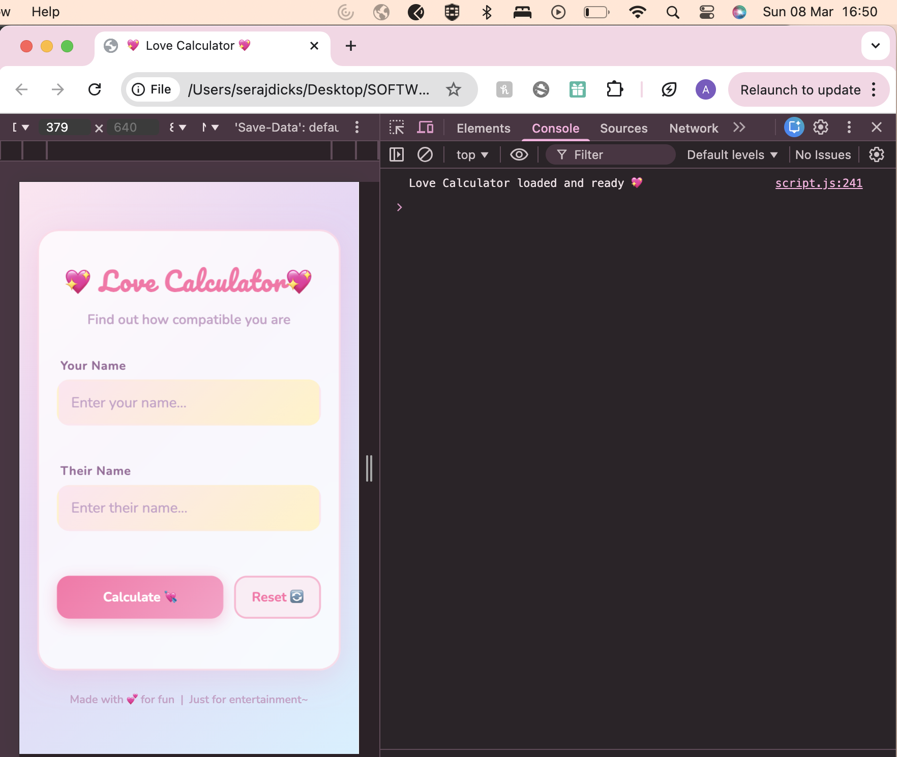
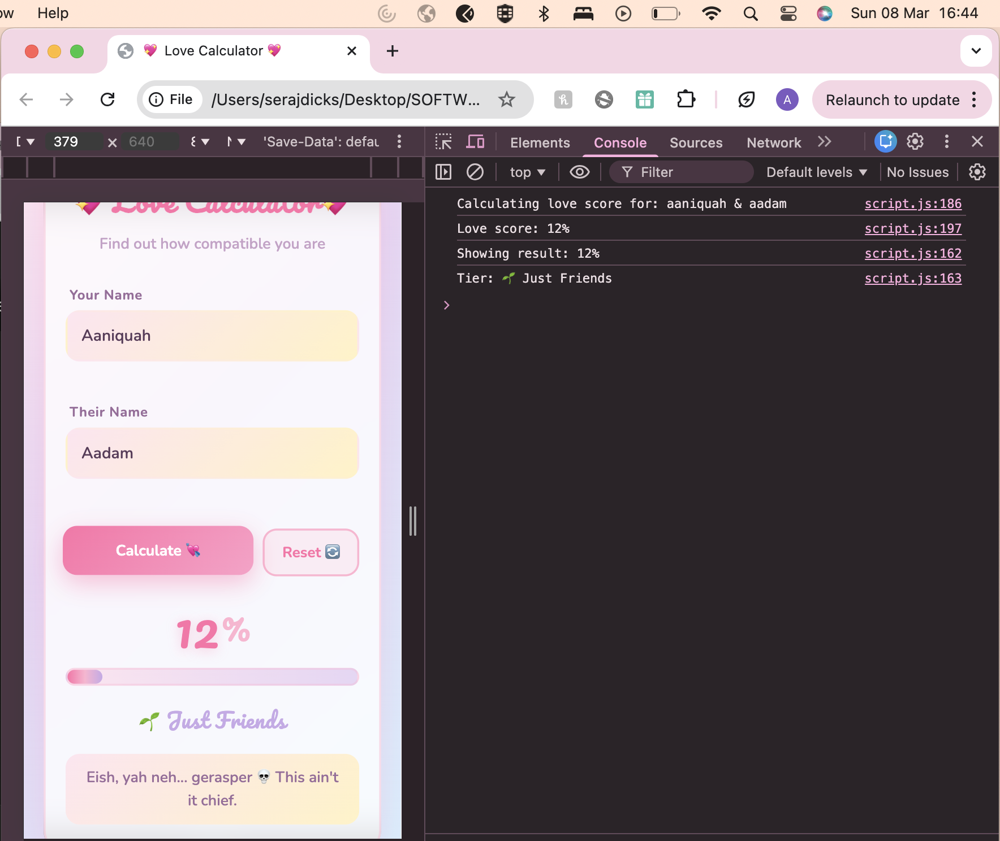
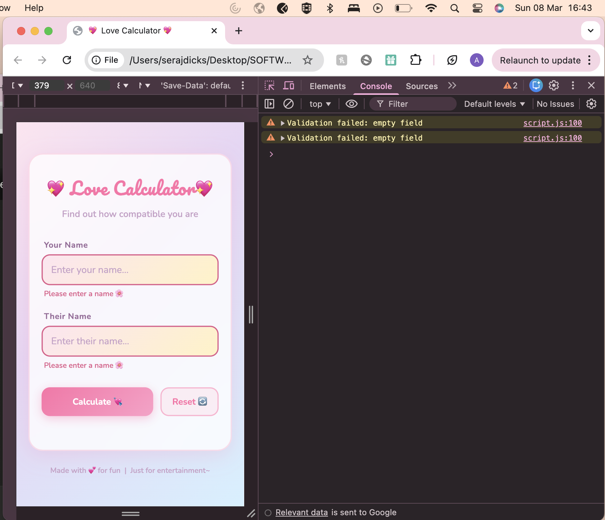
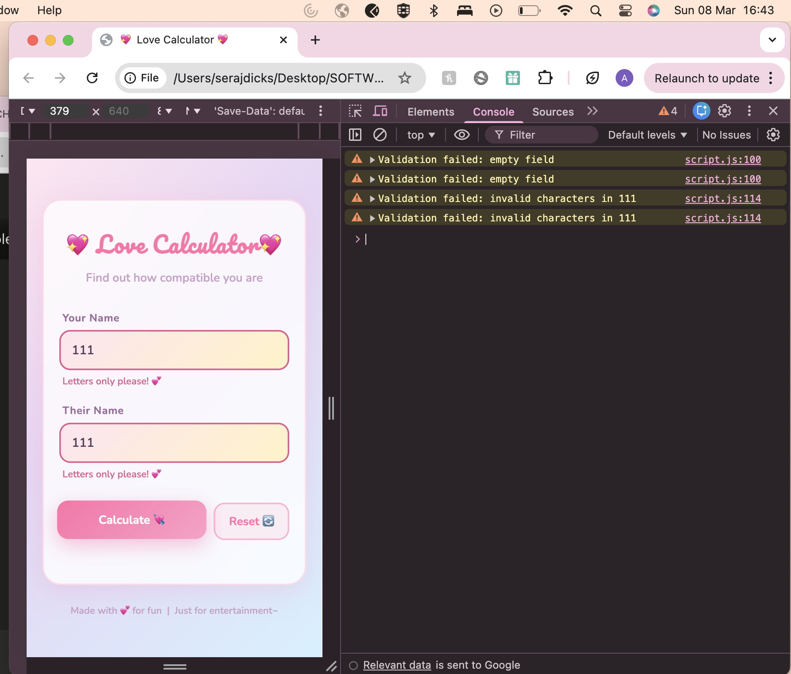
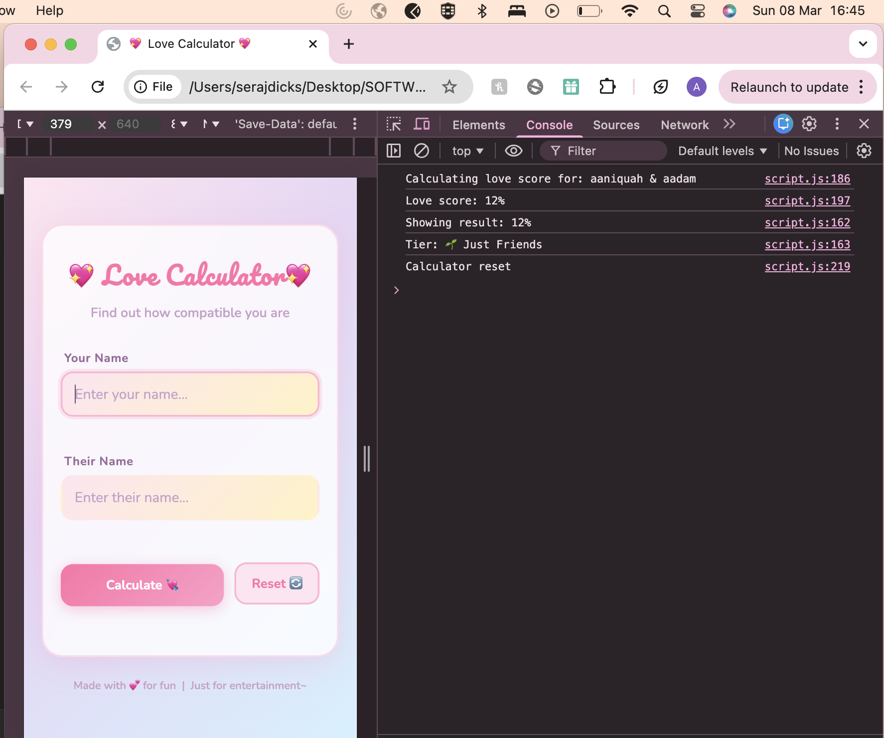

# 💖 Love Calculator

The Love Calculator is a fun and interactive web application that calculates a compatibility score between two people based on their names. Built using pure HTML, CSS, and Vanilla JavaScript with no frameworks or dependencies, the app features a soft pastel aesthetic with smooth animations, input validation, and tier-based result messages written in Gen-Z and South African slang.

This project was developed as part of a Software Engineering assignment to demonstrate practical skills in version control using Git and GitHub. Throughout the development process, meaningful commits were made at each stage of the project, branches were created for new features and bug fixes, and pull requests were used to merge changes.

Simply enter two names, click **Calculate 💘** and the app will generate a love compatibility score between 0–100%. The result includes an animated percentage count-up, a progress bar, a tier label, and a fun personalised message. You can also press **Enter** to calculate, and use the **Reset** button to clear everything and start again.

🌐 **Live Demo:** [https://Aaniquah222641495.github.io/love-calculator](https://Aaniquah222641495.github.io/love-calculator)

---

## 📖 How to Use

1. Enter your name in the **Your Name** field
2. Enter their name in the **Their Name** field
3. Click **Calculate 💘** or press **Enter**
4. Your love compatibility score will appear with a personalised message
5. Click **Reset 🔄** to clear everything and try again

---

## ✨ Features

- 💕 Enter two names and get a love compatibility score (0–100%)
- 🎨 Soft pastel UI with smooth animations
- 📊 Animated progress bar and count-up percentage display
- 💬 Tier-based result messages (6 tiers from *Just Friends* to *Perfect Match!*)
- ✅ Input validation with inline error messages
- ⌨️ Press **Enter** to calculate
- 🔄 Reset button clears everything instantly
- 📱 Fully responsive — works on mobile and desktop

---

## 🛠️ Technologies Used

| Technology | Purpose |
|---|---|
| HTML5 | Page structure and semantic markup |
| CSS3 | Styling, animations, responsive layout |
| Vanilla JavaScript (ES6+) | App logic, DOM manipulation, animations |
| Google Fonts | Pacifico (display) + Nunito (body) |

No frameworks. No build tools. No dependencies.

---

## ⚙️ Prerequisites

- A modern web browser (Chrome, Firefox, Edge, Safari)
- No installations required — this is a plain HTML/CSS/JS project

---

## 🚀 How to Run

1. Clone the repository
   ```bash
   git clone https://github.com/Aaniquah222641495/love-calculator.git
   ```

2. Navigate into the project folder
   ```bash
   cd love-calculator
   ```

3. Open `index.html` in your browser — double-click it or use VS Code Live Server.

The app is also live at: [https://Aaniquah222641495.github.io/love-calculator](https://Aaniquah222641495.github.io/love-calculator)

---

## 📁 Project Structure

```
love-calculator/
│
├── index.html       # Main HTML page (structure & layout)
├── style.css        # All styles (pastel theme, animations)
├── script.js        # App logic (calculator, validation, animations)
├── .gitignore       # Files excluded from Git tracking
├── README.md        # Project documentation (this file)
│
└── screenshots/     # App screenshots with timestamps
    ├── initial.png
    ├── result.png
    ├── validation.png
    ├── validation1.png
    └── reset.png
```

---

## 🔬 How It Works

1. The user enters two names in the input fields
2. On clicking **Calculate 💘** (or pressing Enter), both names are validated
3. The names are sorted alphabetically and combined into a single string
4. A deterministic hash is computed — ensuring the **same pair of names always produces the same score**
5. The score is mapped to a percentage (1–100%) and a result tier
6. The result animates onto the screen with a count-up number and progress bar

---

## 📸 Screenshots

| Screenshot | Preview |
|---|---|
| **Initial State** |  |
| **Result Screen** |  |
| **Input Validation** |  |
| **Input Validation with DevTools** |  |
| **Reset** |  |

---

## 👩‍💻 Author

**Aaniquah Dicks**
Student ID: 222641495
University: Cape Peninsula University of Technology
Module: Software Engineering

---

## 📜 License

This project was created for educational purposes as a university assignment.
Feel free to use it as a reference or learning resource.

---

*Made with 💕 and lots of pastel colours~*
